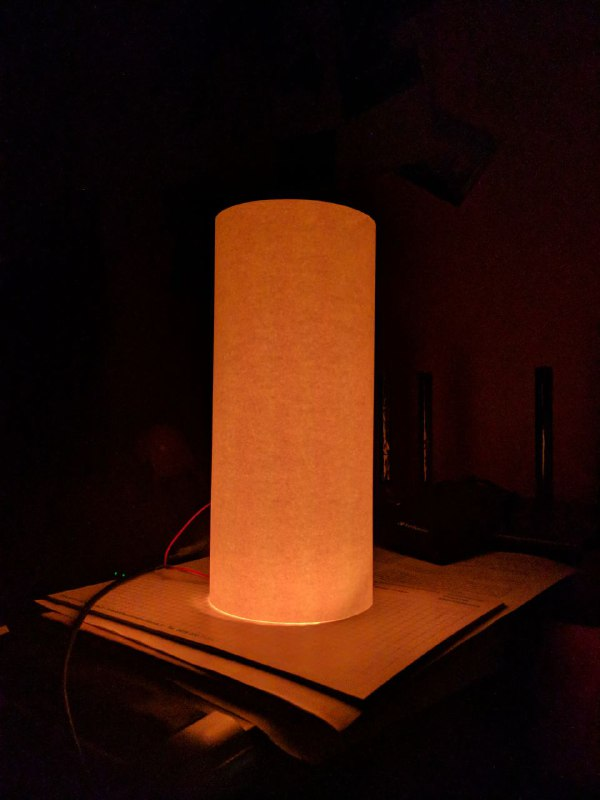

# STM8 Candle

Simulate the flame of a candle with WS2812B leds on an STM8S103.

The code is a mashup of [stm8_fun](https://github.com/abhra0897/stm8_fun) and [FastLED](https://github.com/FastLED/FastLED).

## Requiremets
- Platformio

Compiled and tested with SDCC v4.1.0